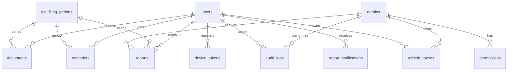

# 05 — Backend Schema (data structures, tables, auth, relations)

**Project:** CA Practice Management Platform — Phase 1 (GST Module)
**Related docs:** `02-trd.md`, `../PROJECT_CONTEXT.md` §6

Database: **PostgreSQL 16** (self-hosted on the EC2 instance). ORM: **TypeORM** with versioned migrations. Schema mirrors PROJECT_CONTEXT §6 with refinements for the auth model and foreign keys.

---

## 1. Entity relationship diagram



---

## 2. Tables

### `users` — client accounts (GST / future ITR)
| Column | Type | Constraints / notes |
|---|---|---|
| `id` | `uuid` | PK, default `gen_random_uuid()` |
| `name` | `varchar(120)` | NOT NULL |
| `email` | `varchar(255)` | NOT NULL, UNIQUE (case-insensitive index) |
| `password_hash` | `varchar(255)` | NOT NULL (argon2) |
| `phone` | `varchar(20)` | NULL |
| `gstin` | `varchar(15)` | NULL, UNIQUE |
| `user_type` | `enum('gst','itr')` | NOT NULL, default `'gst'` |
| `status` | `enum('active','inactive')` | NOT NULL, default `'active'` |
| `created_at` | `timestamptz` | default `now()` |
| `updated_at` | `timestamptz` | on update |

Indexes: `idx_users_email`, `idx_users_user_type`.

### `admins` — CA + staff accounts
| Column | Type | Constraints / notes |
|---|---|---|
| `id` | `uuid` | PK |
| `name` | `varchar(120)` | NOT NULL |
| `email` | `varchar(255)` | NOT NULL, UNIQUE |
| `password_hash` | `varchar(255)` | NOT NULL (argon2) |
| `role` | `enum('super_admin','staff')` | NOT NULL, default `'staff'` |
| `status` | `enum('active','inactive')` | NOT NULL, default `'active'` |
| `created_at` | `timestamptz` | default `now()` |

Indexes: `idx_admins_email`.

### `permissions` — granular flags per admin (not fixed roles)
| Column | Type | Constraints / notes |
|---|---|---|
| `id` | `uuid` | PK |
| `admin_id` | `uuid` | FK → `admins.id`, ON DELETE CASCADE |
| `permission_key` | `varchar(50)` | NOT NULL (e.g. `view_clients`) |
| `granted` | `boolean` | NOT NULL, default `false` |

UNIQUE constraint: `(admin_id, permission_key)`.
Index: `idx_permissions_admin`.

Canonical permission keys (see `01-prd.md` §6): `view_clients`, `view_documents`, `upload_reports`, `send_reminders`, `manage_staff`, `view_audit_logs`, `manage_settings`. Super Admin is implicitly granted all; no rows required.

### `gst_filing_periods` — filing calendar (drives reminders)
| Column | Type | Constraints / notes |
|---|---|---|
| `id` | `uuid` | PK |
| `period_label` | `varchar(30)` | NOT NULL, UNIQUE (e.g. `July 2026`) |
| `period_code` | `varchar(7)` | NOT NULL, UNIQUE (e.g. `2026-07`) |
| `due_date` | `date` | NOT NULL |
| `is_open` | `boolean` | default `true` — whether clients can still upload |
| `created_at` | `timestamptz` | default `now()` |

### `documents` — client-uploaded files
| Column | Type | Constraints / notes |
|---|---|---|
| `id` | `uuid` | PK |
| `user_id` | `uuid` | FK → `users.id`, CASCADE |
| `filing_period_id` | `uuid` | FK → `gst_filing_periods.id` |
| `s3_key` | `varchar(500)` | NOT NULL |
| `original_filename` | `varchar(255)` | NOT NULL |
| `file_type` | `enum('pdf','image','excel')` | NOT NULL |
| `file_size_bytes` | `bigint` | NOT NULL |
| `status` | `enum('pending','received','processed')` | NOT NULL, default `'pending'` |
| `uploaded_at` | `timestamptz` | default `now()` |
| `processed_at` | `timestamptz` | NULL until processed |

Indexes: `idx_documents_user_period (user_id, filing_period_id)`, `idx_documents_status`.

### `reports` — completed GST reports delivered to clients (full history kept)
| Column | Type | Constraints / notes |
|---|---|---|
| `id` | `uuid` | PK |
| `user_id` | `uuid` | FK → `users.id`, CASCADE |
| `filing_period_id` | `uuid` | FK → `gst_filing_periods.id` |
| `report_type` | `enum('gstr_1','gstr_3b','reconciliation','other')` | NOT NULL |
| `s3_key` | `varchar(500)` | NOT NULL |
| `original_filename` | `varchar(255)` | NOT NULL |
| `sent_by_admin_id` | `uuid` | FK → `admins.id` (nullable — seeded/system) |
| `sent_at` | `timestamptz` | default `now()` |

Index: `idx_reports_user_period (user_id, filing_period_id)`.

### `reminders` — every send (auto + manual) is logged
| Column | Type | Constraints / notes |
|---|---|---|
| `id` | `uuid` | PK |
| `user_id` | `uuid` | FK → `users.id`, CASCADE |
| `filing_period_id` | `uuid` | FK → `gst_filing_periods.id` |
| `channel` | `enum('push','email')` | NOT NULL |
| `status` | `enum('queued','sent','failed')` | NOT NULL |
| `sent_at` | `timestamptz` | NULL until sent |
| `triggered_by` | `varchar(40)` | NOT NULL — `'system'` or admin `uuid` |

Indexes: `idx_reminders_user`, `idx_reminders_period`.

### `audit_logs` — accountability trail for admin actions
| Column | Type | Constraints / notes |
|---|---|---|
| `id` | `uuid` | PK |
| `admin_id` | `uuid` | FK → `admins.id` (nullable — system) |
| `action` | `varchar(100)` | NOT NULL (e.g. `document.view`, `report.upload`, `reminder.send`, `staff.create`) |
| `target_user_id` | `uuid` | FK → `users.id` (nullable) |
| `target_period_id` | `uuid` | FK → `gst_filing_periods.id` (nullable) |
| `detail` | `jsonb` | NULL — free-form context |
| `created_at` | `timestamptz` | default `now()` |

Index: `idx_audit_admin_time (admin_id, created_at)`.

### `refresh_tokens` — server-side refresh token storage
| Column | Type | Constraints / notes |
|---|---|---|
| `id` | `uuid` | PK |
| `subject_type` | `enum('user','admin')` | NOT NULL |
| `subject_id` | `uuid` | NOT NULL (FK to `users.id` or `admins.id` by type) |
| `token_hash` | `varchar(255)` | NOT NULL, UNIQUE — sha256 of the token (never store raw) |
| `expires_at` | `timestamptz` | NOT NULL |
| `revoked_at` | `timestamptz` | NULL |
| `created_at` | `timestamptz` | default `now()` |

Index: `idx_refresh_subject`.

### `device_tokens` — FCM push subscriptions
| Column | Type | Constraints / notes |
|---|---|---|
| `id` | `uuid` | PK |
| `user_id` | `uuid` | FK → `users.id`, CASCADE |
| `platform` | `enum('pwa','android')` | NOT NULL |
| `push_token` | `varchar(500)` | NOT NULL (FCM web endpoint or native token) |
| `created_at` | `timestamptz` | default `now()` |

UNIQUE: `(user_id, push_token)`. This table lets the backend reach a user's devices on any channel.

---

## 3. Enums summary

| Enum | Values |
|---|---|
| `user_type` | `gst`, `itr` |
| `user_status` | `active`, `inactive` |
| `admin_role` | `super_admin`, `staff` |
| `admin_status` | `active`, `inactive` |
| `document_file_type` | `pdf`, `image`, `excel` |
| `document_status` | `pending`, `received`, `processed` |
| `report_type` | `gstr_1`, `gstr_3b`, `reconciliation`, `other` |
| `reminder_channel` | `push`, `email` |
| `reminder_status` | `queued`, `sent`, `failed` |
| `subject_type` | `user`, `admin` |
| `device_platform` | `pwa`, `android` |

---

## 4. Auth model

- **Password:** argon2 hash (memory/time costs tuned); never stored in plaintext.
- **Login (client or admin):** verify email + hash → issue:
  - **Access JWT** (TTL 15m) carrying `sub` (user/admin id), `type` (`user`|`admin`), `role` (admins), and — for staff — their permission keys.
  - **Refresh JWT** (TTL 30d) stored hashed (sha256) in `refresh_tokens`; rotation on use; revocable.
- **Refresh flow:** `POST /api/v1/auth/refresh` → verify refresh token hash + not revoked + not expired → issue a new pair, rotate the stored hash.
- **Guards:** `JwtAuthGuard` (validates access token) → `RolesGuard`/`PermissionsGuard` (admins only, permission-key check). Client endpoints scope all queries by `sub` (a client can only touch their own rows).

## 5. Upload / download data flow (files never proxied)

```
UPLOAD (client → S3, server only signs)
  client ──POST /documents/upload-url──► server
       ◄── { document_id, upload_url } ──
  client ──PUT file ──────────────► S3 (pre-signed, short expiry)
  client ──POST /documents/:id/confirm─► server  (marks 'received')

DOWNLOAD (viewer → S3, server only signs)
  viewer ──GET /documents/:id/download-url──► server
       ◄── { download_url } (short-lived signed GET)
  viewer ──GET url ───────────────► S3
```

S3 key convention: `docs/<user_id>/<period_code>/<uuid>.<ext>` and `reports/<user_id>/<period_code>/<uuid>.<ext>`.

## 6. Migration strategy

- TypeORM migrations committed with the schema; applied on deploy (`npm run migration:run`).
- Seed script creates: the **Super Admin** (from env), initial `gst_filing_periods` rows (current + next months).
- Backups: nightly `pg_dump` of the `ca_sanjay_gst` database → `s3://ca-sanjay-backups/` (retention policy noted in deployment runbook).

## 7. Notes / future-proofing

- `user_type` + `permissions` table are ready for **Phase 2 (ITR)** and for evolving staff roles without schema rework.
- `refresh_tokens` and `device_tokens` are first-class tables (not in the original sketch) — required for the approved JWT + push architecture.
- Reports keep **full history** — never delete rows; superseded reports remain downloadable.